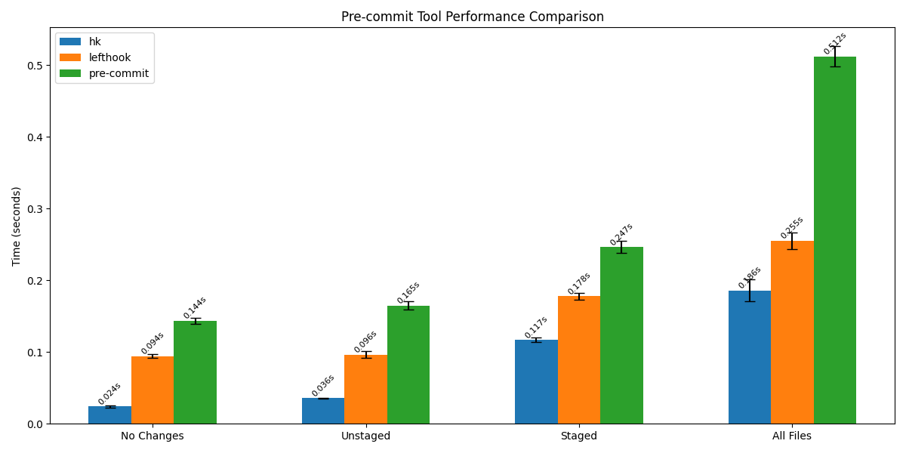

# About

hk is built by [@jdx](https://github.com/jdx).

::: danger
This doc is a half-written draft. Once hk hits 1.0 I will come back and complete it.
:::

## Why does this exist?

In short: performance and [mise-en-place](https://mise.jdx.dev/). Initially mise users wanted more functionality than mise provides
in its basic `mise generate git-pre-commit` command provided—such as the ability to only run tasks when certain files are changed.

Rather than bake that into mise, I felt it was unique enough to warrant a new tool. mise users [benefit](/mise_integration) quite a bit from pairing hk
with mise, but hk certainly doesn't require mise at all.

Once I started looking into this problem more I had quite a bit of ideas on how pre-commit hooks could run faster. These ideas are very
experimental right now so I won't be documenting them until 1.0 but to my knowledge these are things no other git hook manager has.

hk also has a ton of [builtins](https://github.com/jdx/hk/tree/main/pkl/builtins) for common linters and formatters. Expect this list to grow
significantly as we approach 1.0. (Also consider contributing to them!)

### Comparison to lefthook

[lefthook](https://lefthook.dev) is a tool for defining git hooks. Unlike pre-commit and hk, it mostly provides a config file for you to
write your own hooks in. lefthook is less "batteries included" than hk.

- lefthook is written in go, hk is written in rust. This will make hk faster but the advanced parallelism logic in hk should make hk much faster.
  Because git hook managers are often limited not by their own logic but the speed of the commands they run, this should make hk signficantly faster
  in real-world usage.
- Using pkl instead of yaml/toml/etc means that a lot of features in lefthook we simply don't need to build like `extends` and `templates`. We get these for free with pkl.
- lefthook just has "run" commands but hk separates out the concepts of "check" vs "fix" commands which gives control over when linters modify files and when they do not.

### Comparison to pre-commit

[pre-commit](https://pre-commit.com/) is a popular framework for git pre-commit hooks. It's built with a plugin model
which allows sharing of common pre-commit logic. As I see it, here are the drawbacks of pre-commit compared to hk:

- I find pre-commit generally quite clunky.
- hk is written in rust, pre-commit is written in python. hk will be much faster.
- I find pre-commit plugins to be painful to work with. The ergonomics of `.pre-commit-config.yaml` I felt left a lot to be desired.
  Specifically, I don't like that I need to look up the rev for each plugin before I'm able to install it.
- hk gets around needing plugins (for now) by putting the entire configuration in pkl. pkl files can be loaded via
  http without any extra work in hk so we basically get plugins "for free" this way.
- because hk uses pkl, loading the configuration is much faster because pkl doesn't have any runtime logic that needs to be computed.
- I read that pre-commit has some parallel execution capabilities, but the docs don't explain anything about it. A proper git hook manager
  should have advanced configuration around parallel execution to be able to group linters that can run in parallel and segment out those that can't.

## Benchmarks

## Roadmap

There isn't one yet. This project will hit 1.0 when I feel it has good enough parity that almost anyone would be able to switch from lefthook or pre-commit to hk.

Until then, expect frequent breaking changes and experimentation as I try to identify the proper behavior of hk.

## Contributing

Contributions are welcome! Please open an issue or submit a PR.
